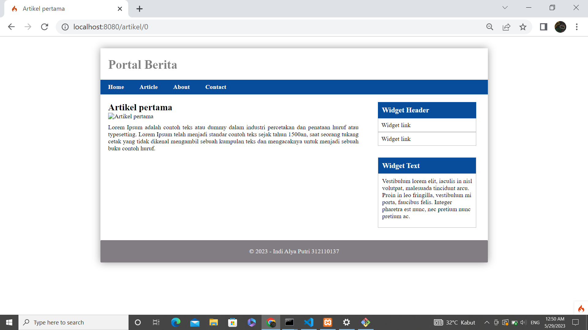
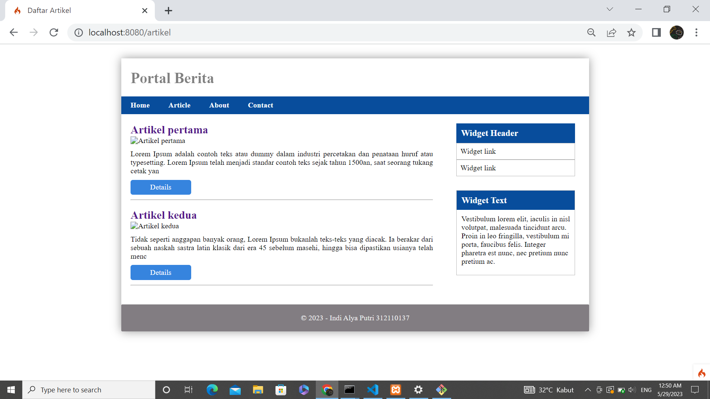
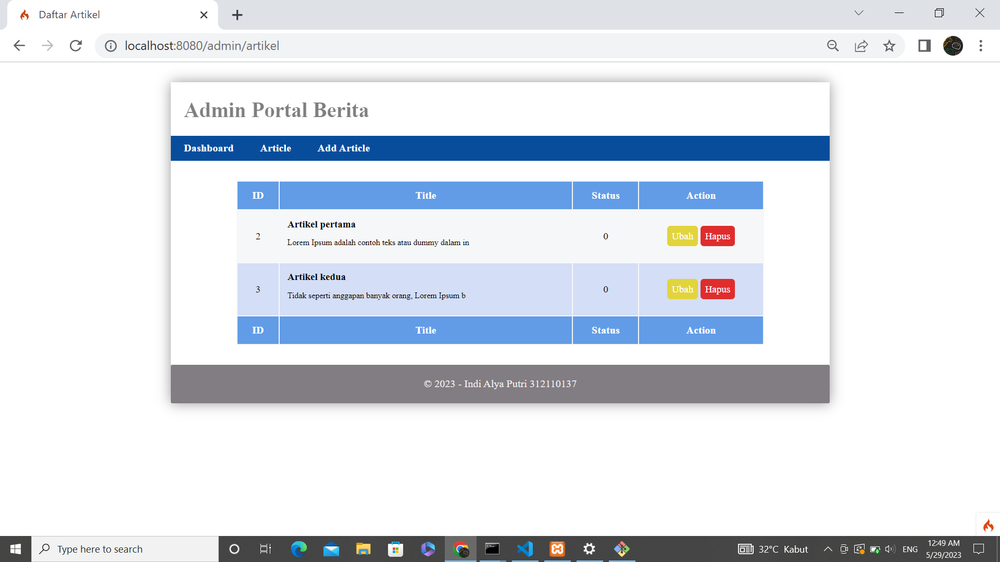
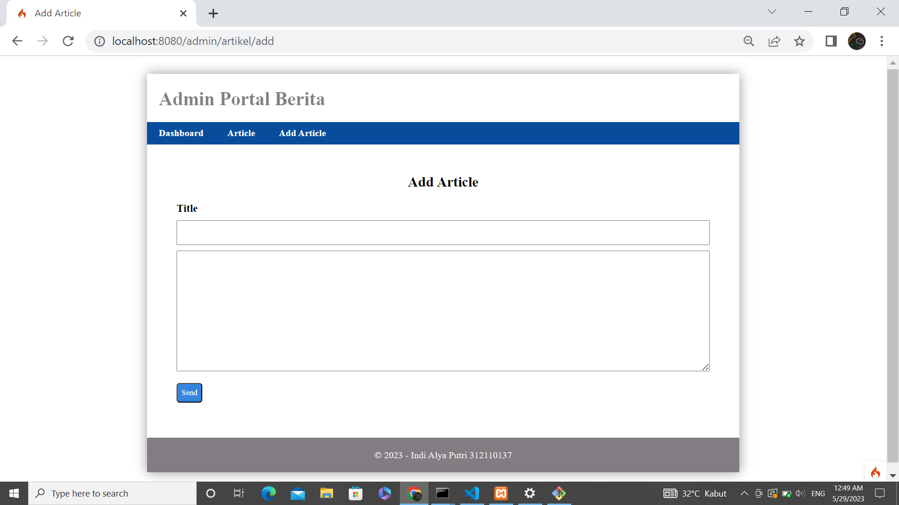

# flutter-login 
```bash
Nama      : Indi Alya Putri
NIM       : 312110137
Kelas     : TI.21.A3
M. Kuliah : Pemograman Mobile 2
Dosen     : Muhammad najamuddin dwi miharja,S.Kom.,M.Kom
```
</br></br>
 
## **halaman home = /artikel**



</br></br>

## **halaman artikel = /artikel**



</br></br>

## **halaman admin = /admin/artikel **



</br></br>

## **halaman admin = /admin/artikel/add**



</br></br>


